# Mendix on Azure Kubernetes Service

This how-to outlines how to deploy a scalable, production-ready Kubernetes cluster for hosting Mendix apps on Microsoft Azure. The solution includes all components necessary to succesfully build and operate Mendix apps on Azure and consists of the following components:

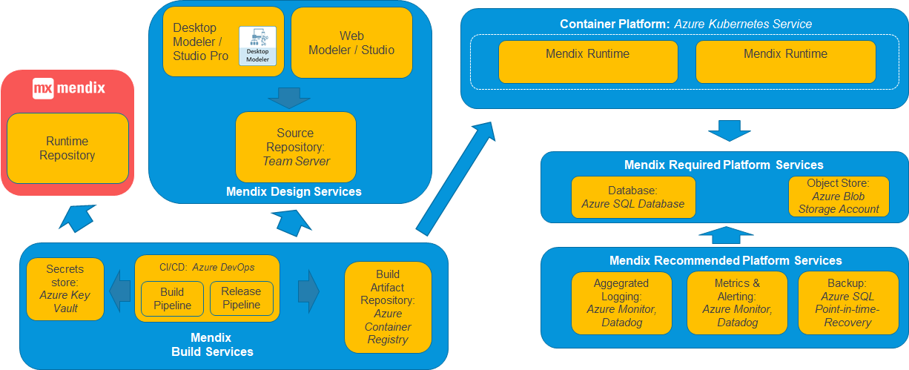

## Features of the solution:

- Host Mendix apps in a secure, scalable and managed environment.
- Utilize standard Azure services to ensure cost-effectiveness
- Utilize Azure  DevOps for automated deployments, fully in control of your team

## How to deploy

### Prerequisites

- Account with Owner role assignment on the target Azure Subscription.

### Deploying Container Platform (Azure Kubernetes Service)

The Mendix apps will run in Docker containers which will be orchestrated using Kubernetes. For this purpose we are going to deploy Azure Kubernetes Service, which will provide us with a managed Kubernetes cluster to host our app containers.

#### Deploying Azure Kubernetes Service

1. Sign in to the Azure Portal (https://portal.azure.com).
2. Start the wizard to create an Azure Kubernetes Service.
3. Fill out the basic information:
   * **When choosing node size:** keep in mind that Mendix containers typically need relatively more memory vs. CPU. So choosing instance sizes with a higher memory to CPU ratio tends to be more cost efficient (e.g. E2s_v3).
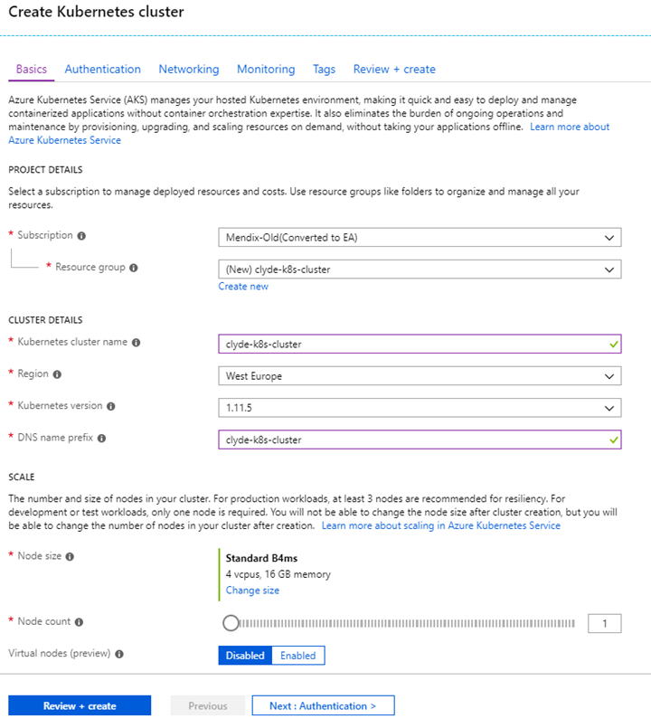
4. Fill out the scaling information:
   * **With regards to enabling Virtual Nodes:** The Virtual nodes option allows container to be directly scheduled on [Azure Container Instances](https://azure.microsoft.com/en-us/services/container-instances/). We will not use this option in this how-to. Since Mendix containers typically run 24/7, using VMs as dedicated agent nodes is typically more cost-effective.
   * **With regards to enabling VM Scale Sets:** We will not enable VM scale sets in this how-to as the feature is stil in Preview. It promises a lot more flexibility and can be valuable in the future.
5. Fill out the authentication information:
   * **With regards to enabling RBAC:** Role-Based Access Control (RBAC) allows you to define security roles within the cluster and assign different cluster permissions to different groups of users, enabling this is required in order to run a secure cluster.
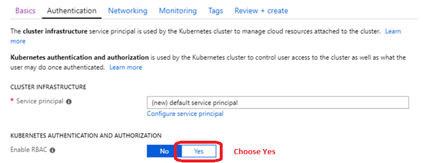
6. Fill out the network information:
   * **HTTP Application routing:** we disable this as we will deploy an NGINX ingress controller that supports HTTPS later.
   * **Network configuration:** we will select Basic to deploy to a newly created VNet. Specifying an Advanced network configuration is required when we want to deploy to a custom VNet (e.g. a VNet routable over an ExpressRoute).
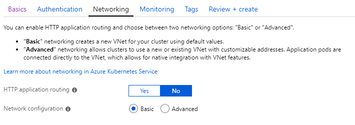
 7. Fill out the monitoring information
    * Enable this to use the built-in cluster monitoring features of Azure.
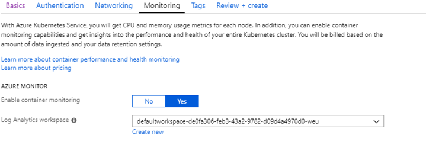
 8. Optionally, fill out tags (e.g. for cost tracking)
 9. Confirm your choices to start deployment of the cluster

#### Connecting to the Kubernetes cluster

1. After the deployment of the Kubernetes Service,  a resource group will have been created containing the cluster object:

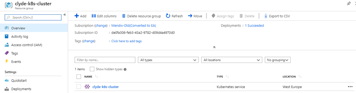 

2. [Open the Kubernetes Dashboard](https://docs.microsoft.com/nl-nl/azure/aks/kubernetes-dashboard) 
3. The cluster has been deployed successfully and can be managed from your workstation!

### Deploying the cluster load balancer (NGINX Ingress Controller)

Web traffic has to flow from outside the cluster towards the right Mendix containers in the cluster. In the Kubernetes world, this is handled by an ingress controller. We will deploy the NGINX ingress controller into the cluster. We will do this using helm, the package manager for Kubernetes.

##### Installing Helm

1) Install helm: [https://helm.sh/](https://helm.sh/)

2) Add helm to your system PATH (see [https://www.architectryan.com/2018/03/17/add-to-the-path-on-windows-10/](https://www.architectryan.com/2018/03/17/add-to-the-path-on-windows-10/) for instructions on Windows)
3) Create a service account for Tiller, as described [here](https://github.com/helm/helm/blob/master/docs/rbac.md#tiller-and-role-based-access-control)
4) Initialize Tiller (the server-side component of Helm) on the cluster by running: 

> helm init --service-account tiller

### Installing NGINX Ingress Controller

1. Install NGINX into the cluster by running:

>     helm install stable/nginx-ingress

 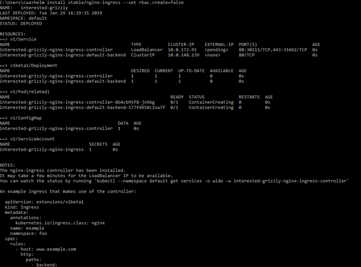
 
 2. (Optional) In case you deployed on an internal VNet, be sure to add the _service.beta.kubernetes.io/azure-load-balancer-internal: "true"_ annotation as outlined here_:_ [https://docs.microsoft.com/en-us/azure/aks/internal-lb](https://docs.microsoft.com/en-us/azure/aks/internal-lb)
 3. After a few minutes, run: 

> kubectl get services –output wide

4. The output should contain the external IP address of the load balancer

 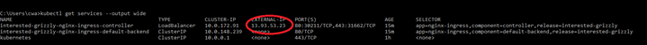

5. By opening this URL in your browser, you can verify communication from your workstation to the cluster is fully functioning:

 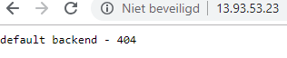

### Setting up build and release pipelines using Azure DevOps

We will use Azure Devops to automatically deploy the following components:

 - Azure SQL Server & Elastic Pool
 - Azure Container Registry
 - Azure Keyvaults (for master secrets and app-specific secrets)
 - An app onboarding pipeline (for adding new apps to the cluster, it will deploy per app: databases, Azure Blob Storage Accounts,key vaults, build & release pipelines)

#### Setting up the Mendix Azure DevOps project

In this how-to we will use Azure DevOps as a CI/CD solution to execute the pipelines. If you know what you are doing, any other CI/CD solution (e.g. Jenkins, Gitlab) can be used instead. But this how-to accompanies fully-working templates for  Azure DevOps.  A free version of Azure Devops can be obtained by creating a new account at [https://dev.azure.com](https://dev.azure.com) .

**Installing required extensions and configuring Service Connections:**

 1. Login to your Azure DevOps environment and create a new project called *Mendix*.
 2.  We need to install some extensions which we will use in our pipelines. This has to be done in the organizational settings pane of Azure Devops. Please install the following extensions from the Azure DevOps marketplace:

 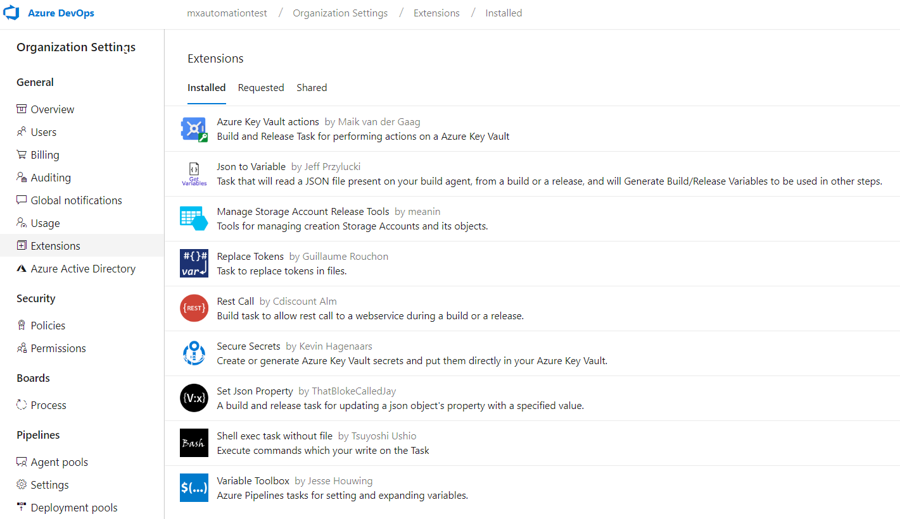

3. Next, we need to create several Service Connections in our Azure DevOps project and write down the corresponding GUIDs so that they can be leveraged in the pipelines. All service connections 

**Azure Resource Manager Service Connection**

Create a service connection of the type Azure Resource Manager, connecting Azure DevOps to your Azure subscription. Note the GUID of the service connection, which you will find in the address bar of your browser when the service connection is selected:

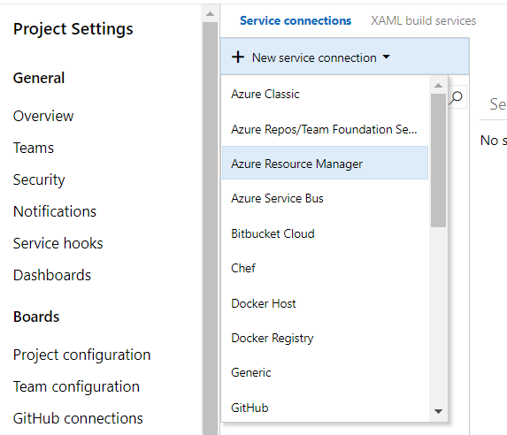
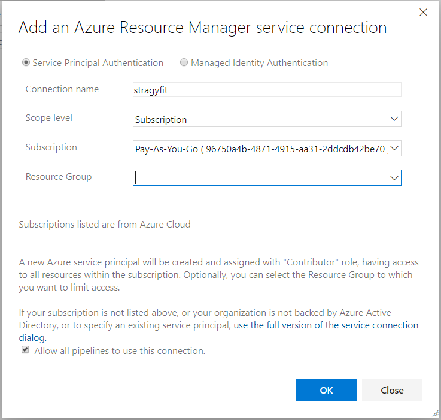
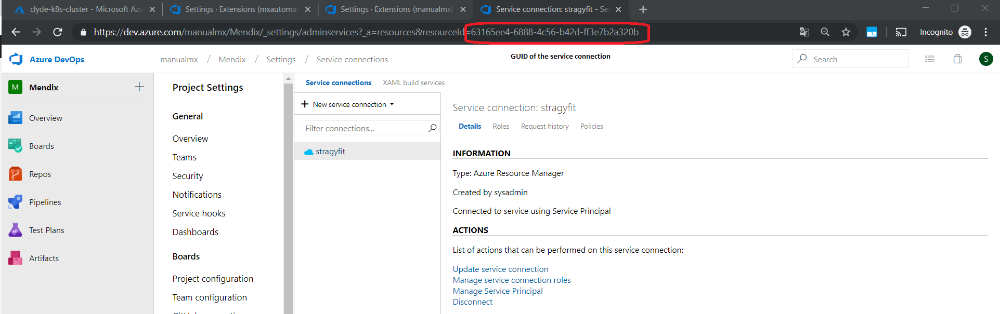

**Azure DevOps REST API Service Connections**

The pipelines we will create in the upcoming steps will use the Azure DevOps REST API to interface with Azure DevOps itself. We need to create two Service Connections (of type *Generic*) for this. Before we can do that, we need to create a Personal Access Token (PAT) for our  current Azure DevOps. Follow the instructions [here](https://docs.microsoft.com/en-us/azure/devops/organizations/accounts/use-personal-access-tokens-to-authenticate?view=azure-devops#create-personal-access-tokens-to-authenticate-access) to create a PAT with full access (all scopes) and note down the PAT.

We need to create two Generic Service Connections:

**Azure DevOps**
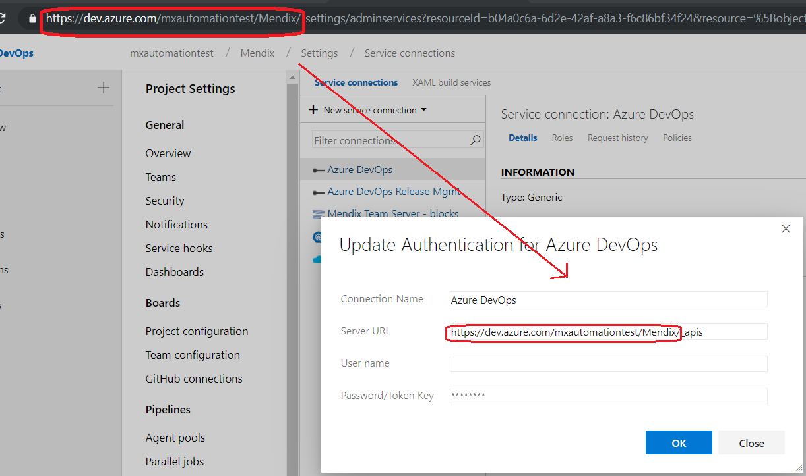

The URL of this Service Connection is the project URL appended with _apis:

When configuring the Service Connection  you should enter your username combined with the PAT as Password/Token Key.

**Azure DevOps Release Mgmt**
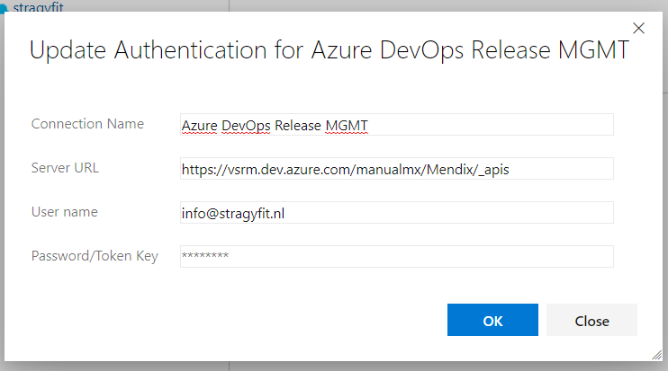

The configuration of this Service Connection is identical, with one exception: the hostname in the URL is vsrm.dev.azure.com instead of dev.azure.com:

**Kubernetes Service Connection**

Finally, we need to create a Service Connection that allows Azure DevOps to connect to our Kubernetes cluster.
Create a Service Connection of the type Kubernetes. The field KubeConfig should contain the contents of the kubectl config file which you can find in "your home/profile directory/.kube/config":

**Note down the GUIDs of all four Service Connections**

**Importing the initial deployment pipelne**

Download and save [the initial deployment pipeline](https://raw.githubusercontent.com/MXClyde/mendix-kubernetes-azure/master/manifests/azuredevops/Initial%20Mendix%20Setup.json) to your computer.

Before the Azure DevOps UI will show us the option of importing a Release pipeline we need to add an empty Release pipeline. Go ahead and create an empty pipeline:

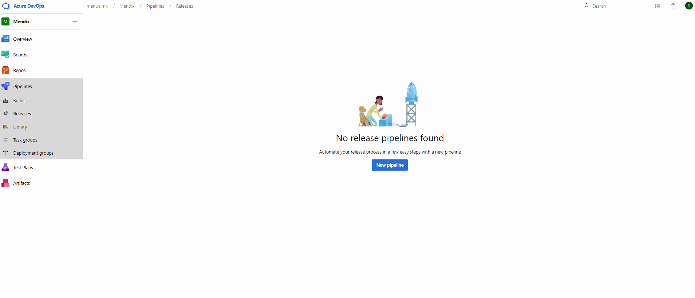

Now import the initial deployment pipeline you downloaded from this repository.
You will have to manually configure it to use the "Hosted Ubuntu 1604" agent.

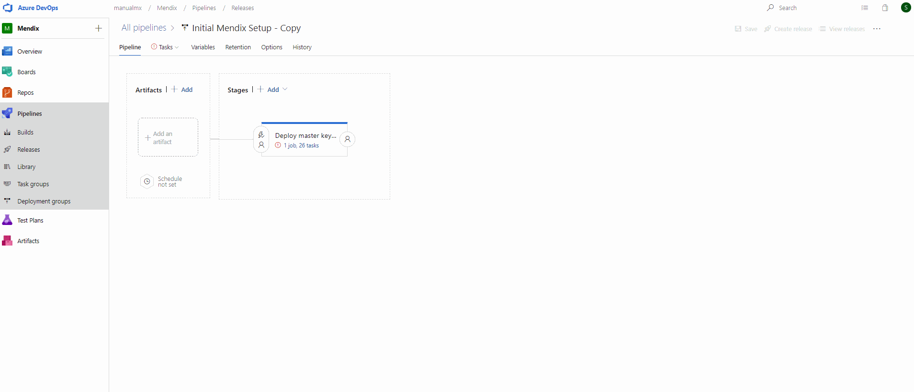

**Executing the initial deployment pipeline**

Now execute the pipeline by creating a release and filling out the correct paramete values, as per the table below:

|Variable  |Description  |
|-----------|------------|
|Azure_DataResourceGroup|Name of the  resource group in which to deploy databases, key vaults and storage accounts|
|Azure_DataResourceGroup_Region|  [Azure Region]([https://github.com/BuildAzure/azure-region-map/blob/master/data/azure_regions.json](https://github.com/BuildAzure/azure-region-map/blob/master/data/azure_regions.json)) of data resourcegroup, e.g. *westeurope*|
|Azure_Subscription| GUID of the Azure Resource Manager Service Connection  |
|AzureDevOps_API_Endpoint| GUID of the Azure DevOps API Service Connection |
|AzureDevOps_Release_API_Endpoint| GUID of the Azure DevOps Release Management API Service Connection |
|kubernetes_cluster| GUID of the Kubernetes cluster Service Connection |
|orgname| Select a short orgname (<10 characters) that will be used  |
|Ubuntu_Pool_QueueID|The queue ID of the Hosted Ubuntu agent pool* |
|VS2017_Pool_QueueID|The queue ID of the Visual Studio 2017 agent pool* |

* Queue IDs of Agent Pools can be derived by hovering 
Correctly filled out, it looks like this:

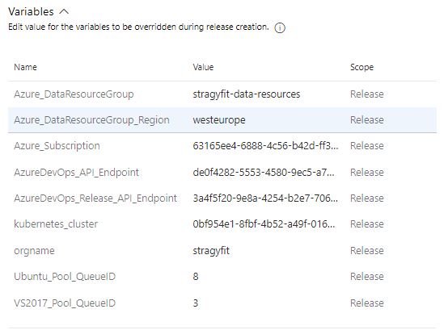

Executing this pipeline will:

 - Deploy a master key vault to store service credetnials
 - Deploy an Azure SQL Server and Elastic Pool to host app databases.
 - Deploy Azure Container Registry to host app Docker images
 - Deploy a "New App Onboarding pipeline" which will allow you to add new Mendix apps to your environment.

**Onboarding a new app**

Onboard a new app by creating a new release of the "New app onboarding pipeline". It takes the following arguments:

|Variable  |Description  |
|--|--|
|appfqdn_accp | The FQDN for the acceptance environment of the app |
|appfqdn_accp_leader| The FQDN for targetting only the leader container of the acceptance environment (e.g. for reaching the debugger endpoint consistently)|
|appfqdn_prod| The FQDN for the production environment of the app|
|appfqdn_prod_leader|  The FQDN for targetting only the leader container of the production environment|
|appname| appname (should be short, < 8 characters)|
|ts_password| Mendix Team Server password to be used to access app model|
|ts_url| URL for app repository on Mendix Team Server|
|ts_username| Mendix Team Server username to be used to access app model|

Correctly filled out it should look like:

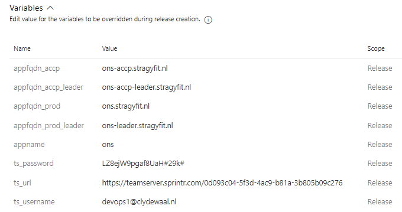

Executing this release will:

- Provision app-specific Key Vaults
- Provision app-specific databases
- Provision app-specific (Blob) Storage Accounts
- Provision Kubernetes namespaces for acceptance and production environments
- Provision apps-specific build & release pipelines

### Adding extended logging & metrics using Datadog

 

 1. Create a Datadog (trial) account at [http://www.datadoghq.com](http://www.datadoghq.com) and get the API key.
 2. Download the Datadog templates from manifests/kubernetes/datadog in this repository.
 3. Insert the Datadog API key in line 26 of datadog.yaml
 4. Apply both manifests to your clusters

>  kubectl create -f datadog.yaml  
>  kubectl create -f datadog-rbac.yaml

5. Within minutes, logging and metrics should start appearing in Datadog.

## Known issues 

## Support 

 - Questions / issues with regards to this reference implementation can be raised in the Issues section of this Github repository, they will be answered on a best-effort basis.
 - The templates published in this repository are **not** a supported Mendix product (although they are in use by several major Mendix customers). I maintain them on a best-effort basis.

## Roadmap

-  Docuument how to use cert-manager
 - Document how to use Azure Insights for monitoring.
 - Document how to use pipelines with other Kubernetes clusters (e.g. AWS EKS).
